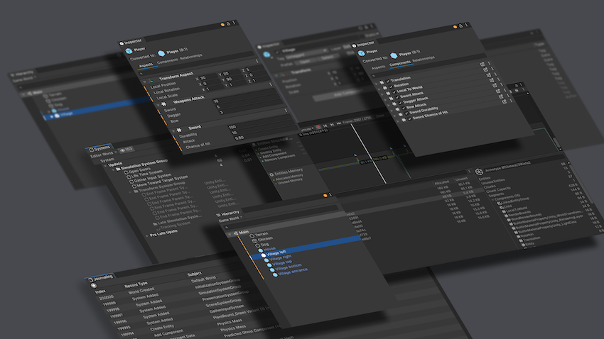

# Entities overview

The Entities package lets you use Unity's Entity Component System (ECS), which organizes your project in a data-oriented way.



## Package installation

To use the Entities package, you must have Unity version 2022.2.0b9 and later installed.

The Entities packages aren't listed in the Package Manager, even if you've enabled the **Preview Packages** setting. You can use the following ways to install the Entities packages:

* Use **Add package from git URL...** under the **+** menu at the top left of the package manager to add packages either by name (such as `com.unity.entities`), or by Git URL (but this option isn't available for DOTS packages). If you want to use a Git URL instead of just a name in the Package Manager, you must have the git command line tools installed.
* Directly edit the `Packages\manifest.json` file in the Unity project. You must add both the package name and its version to the file, which you can find by looking at the documentation of each package (such as `"com.unity.entities" : "x.x.x-preview.x"`).

For more information, see the documentation on [Installing hidden packages](https://docs.unity3d.com/Packages/Installation/manual/index.html).

## Known issues

* If an exception happens in the entity iteration blocks [`Entities.ForEach`](iterating-data-entities-foreach.md) or the idiomatic foreach loop in [`SystemAPI.Query`](xref:Unity.Entities.SystemAPI.Query*), then ECS doesn't clean up the exception if the calling code isn't from a derived system method such as `OnCreate`, `OnUpdate`, `OnDestroy`, `OnStartRunning`, or `OnStopRunning`. This causes further exceptions to be erroneously reported.
* You can't schedule an [`IJobEntity`](iterating-data-ijobentity.md) that takes any argument directly constructed from a method invocation. For example, the following code doesn't work:

    ```c#
    new SomeJob().Schedule(JobHandle.CombineDependecies(handle1, handle2))
    ``` 

    To fix this, store the argument in a local variable and use that as the argument. For example: 

    ```c#
    (new SomeJob().Schedule(someCombinedHandle))
    ```
* If you schedule an [`IJobEntity`](iterating-data-ijobentity.md) constructed with an initialization expression that invokes a [`SystemAPI`](xref:Unity.Entities.SystemAPI) method, such as:

    ```c# 
    SomeJob{targetLookup = SystemAPI.GetComponentLookup<Target>()}.Schedule()
    ``` 

    This causes the following runtime error:  

    ```
    No suitable code replacement generated, this is either due to generators failing, or lack of support in your current context.
    ``` 

    To fix this, put in a local variable first. For example, the following works: 

    ```c#
    var targetLookup = SystemAPI.GetComponentLookup<Target>(); new SomeJob{targetLookup = targetLookup}.Schedule()
    ```
* Calling `SystemAPI` methods from static methods in a system causes the following runtime error:

    ```
    No suitable code replacement generated, this is either due to generators failing, or lack of support in your current context.
    ```

## Additional resources

* [Getting started](getting-started.md)
* [Upgrade guide](upgrade-guide.md)
* [What's new](whats-new.md)
* [ECS packages](ecs-packages.md)
